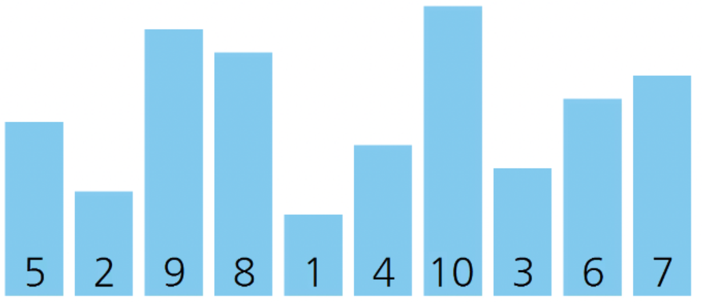

# Selection_sort_visualization
선택 정렬(Selection sort) 알고리즘 시각화


## 0. 그대로 실행 시 주의사항
그대로 실행 시, 하위 디렉토리 ```\frames``` 를 생성하고 학습 내용에 대해 모두 저장하도록 되어 있습니다.
수많은 파일을 생성하고 싶지 않다면, ```Sort_visualization.cs``` 에서 ```Sort_visual```클래스의  ```save_frame()``` 함수를 수정하세요.

## 1. 선택 정렬(Selection sort)
**선택 정렬**

 선택 정렬(Selection sort)은 간단한 정렬 알고리즘 중 하나로, 정렬된 부분과 정렬되지 않은 부분으로 나누고 정렬되지 않은 배열에서 최솟값(또는 최댓값)을 선택하여 정렬된 부분에 차례로 정렬하는 알고리즘

**시간 복잡도**


**의사코드**


## 2. 시각화 방법
**배열 원소 상황 시각화**


**배열 원소 수치 시각화**


